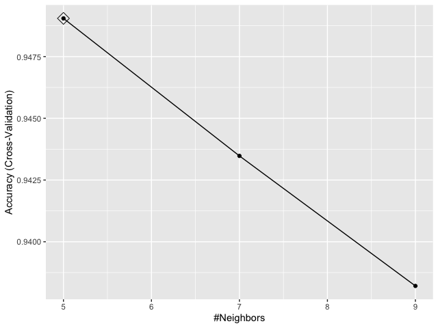
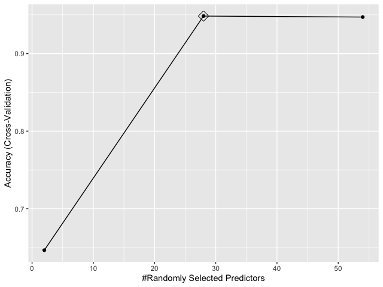
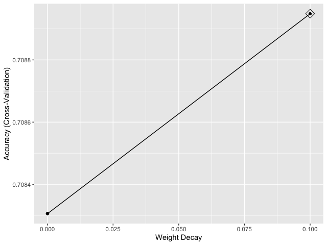

```{r setup, include=FALSE}
knitr::opts_chunk$set(echo = TRUE)
```

```{r loading-libs, message=FALSE, echo=FALSE}
if(!require(tidyverse)) install.packages("tidyverse", repos = "http://cran.us.r-project.org")
if(!require(caret)) install.packages("caret", repos = "http://cran.us.r-project.org")
if(!require(knitr)) install.packages("knitr", repos = "http://cran.us.r-project.org")
library(tidyverse)
library(caret)
library(knitr)
```

```{r loading-data, message=FALSE, echo=FALSE}
load("rda/dat.rda")
load("rda/covtype.rda")
```

### INTRODUCTION

The forest cover type project aims to build a machine learning model that predicts what types of trees grow in an area based on the surrounding characteristics using the **Forest Cover Type Dataset** from  [https://archive.ics.uci.edu/ml/machine-learning-databases/covtype/covtype.data.gz](https://archive.ics.uci.edu/ml/machine-learning-databases/covtype/covtype.data.gz). This dataset contains tree observations from four areas of the Roosevelt National Forest in Colorado. All observations are cartographic variables (no remote sensing) from 30 meter x 30 meter sections of forest. This dataset includes information on tree type, shadow coverage, distance to nearby landmarks (roads, water bodies, etc), soil type, and local topography.

#### Dataset

The cover type data set has `r nrow(covtype)` rows and `r ncol(covtype)` columns. The table below shows the first 10 rows and first 10 columns of the cover type data set.

```{r echo=FALSE}
kable(covtype[1:10,1:10], caption = "Forest Cover Type Dataset")
```

The entire `r ncol(covtype)` columns of the cover type data set, their descriptions and their R data types are shown in the table below.

```{r echo=FALSE}
column_descs <- data.frame(
  name = c(
    "elevation",
    "aspect",
    "slope",
    "x_hydro",
    "y_hydro",
    "x_road",
    "hs_9am",
    "hs_12pm",
    "hs_3pm",
    "x_fire",
    "wa[1:4]",
    "st[1:40]",
    "y"
  ),
  description = c(
    "Elevation in meters",
    "Aspect in degrees azimuth",
    "Slope in degrees",
    "Horizontal distance to nearest surface water features",
    "Vertical distance to nearest surface water features",
    "Horizontal distance to nearest roadway",
    "Hillshade index at 9am, summer solstice",
    "Hillshade index at noon, summer soltice",
    "Hillshade index at 3pm, summer solstice",
    "Horizontal distance to nearest wildfire ignition points",
    "Wilderness area designation (4 binary columns)",
    "Soil Type designation (40 binary columns)",
    "Forest Cover Type designation (integer 1 to 7)"
  ),
  type = c(
    "double",
    "double",
    "double",
    "double",
    "double",
    "double",
    "double",
    "double",
    "double",
    "double",
    "factor",
    "factor",
    "factor"
  )
)
kable(column_descs, caption = "Forest Cover Type Dataset Columns")
```

#### Inputs

The first `r ncol(covtype)-1` columns of the forest cover type dataset form the **features** or **input** of this analysis. Each row is a distinct **observation** or **example**. When all column values of a row are composed together in a **vector** this **vector** is known as the **feature vector** and is desgnated as $\bf{x}$. The complete list of **inputs** are shown in the table below.

```{r echo=FALSE}
column_descs <- data.frame(
  name = c(
    "elevation",
    "aspect",
    "slope",
    "x_hydro",
    "y_hydro",
    "x_road",
    "hs_9am",
    "hs_12pm",
    "hs_3pm",
    "x_fire",
    "wa[1:4]",
    "st[1:40]"
  ),
  description = c(
    "Elevation in meters",
    "Aspect in degrees azimuth",
    "Slope in degrees",
    "Horizontal distance to nearest surface water features",
    "Vertical distance to nearest surface water features",
    "Horizontal distance to nearest roadway",
    "Hillshade index at 9am, summer solstice",
    "Hillshade index at noon, summer soltice",
    "Hillshade index at 3pm, summer solstice",
    "Horizontal distance to nearest wildfire ignition points",
    "Wilderness area designation (4 binary columns)",
    "Soil Type designation (40 binary columns)"
  )
)
kable(column_descs, caption = "Inputs or Features")
```

#### Output

The `r ncol(covtype)`^th^ column of the forest cover type dataset form the **label** or **output** of this analysis. The **output** value can be any one of: **Spruce**, **Lodgepole**, **Panderosa**, **Cottonwood**, **Aspen**, **Douglas**, or **Krummholz** and is desgnated as $y$. The single **output** column is shown in the table below.

```{r echo=FALSE}
column_descs <- data.frame(
  name = c(
    "y"
  ),
  description = c(
    "Forest Cover Type designation"
  )
)
kable(column_descs, caption = "Output or Label")
```

#### Objective

The **goal** is to find a **machine learning function** $h$ that takes a feature vector $\bf{x}$ as **input** and computes a label $y$ as **output**. Expressed as an equation:

$$y = h(\bf{x})$$
where,

* $y$ is the **output** cover type
* $\bf{x}$ is the feature vector of **input** attributes
* $h$ is the trained **machine learning algorithm** or **hypothesis function**

For this purpose we will examine and fit several machine learning algorithms including *k-Nearest Neighbors*, *Random Forest*, *Linear Discriminant Analysis*, *Penalized Multinomial Regression* and *Support Vector Machines with Linear Kernel*. We will also attempt to reduce the dimension of the dataset using *Principal Component Analysis* as a *Matrix Factorization* method.

#### Steps

We start off the analysis by **pre-processing** the entire forest cover type dataset to mutate some columns from their intrinsic data type to a data type that is more appropriate for our analysis. Next we **partition** our dataset into a *train set* and a *test set* using a random 60:40 split respectively. Next we explore the possibility of applying the principal componenent analysis (PCA) method for **dimension reduction**. Then we step right into the meat of the analysis and try out several **machine learning algorithms** by training on the *train set* and evaluating on the *test set*. Finally we build an **ensemble** model using all of the machine learning models already built and examine its accuracy vis-a-vis each individual model. 

#### Problems Encountered

Extended training run times due to large dataset. The entire forest cover type dataset has `r nrow(covtype)` rows. Even at 60:40 split between **train set** and **test set**, the **train set** still has at least `r as.integer(nrow(covtype) * 0.6)` rows. This proves to be a challenge for the built in model evaluation and parameter tuning of the **caret** *train()* function, which uses a 25 round bootstrap resampling for model parameter optimization by default. Many of the models could not be trained successfully because either the *train()* function ran for days on end without completion or the training could not run at all due to memory exhaustion. So to to solve this issue we configured the *train()* function to use k-fold cross validation using code similar to the following.

```{r eval=FALSE}
library(caret)
control <- trainControl(method = "cv", number = 2)
train <- train(y ~ ., method = "my_method", data = dat$train, trControl = control)
```

We found that k-fold cross validation with $k = 2$ or $k = 3$ reduced the training run time of each model to at most 24 hours or a little over that. This was more bearable for this analysis

### METHODS

#### Preprocessing

Columns wa1 to wa4 of the forest cover type dataset are used to describe the wilderness area designation of each dataset row. Similarly, columns st1 to st40 are used to describe the soil type designation. These columns (wa1 to wa4 and st1 to st40) are encoded as 0 or 1 in the original dataset, where 0 means **absence** and 1 means **presence**. A pre-processing was run to mutate these columns to a 2 level factor with levels (absence, presence).

A similar preprocessing was also run on column y of the forest cover type dataset. This column describes the cover type of each row. It was encoded as a integer from 1 through 7, where 1 means spruce, 2 means lodgepole, 3 means panderosa, 4 means cottonwood, 5 means aspen, 6 means douglas, and 7 means krummholz. This column (y) was mutated to a 7 level factor with levels (spruce, lodgepole, panderosa, cottonwood, aspen, douglas, and krummholz).  

#### Partitioning

The forest cover type dataset was partitioned into two sets, a **train** set for training our models, and a **test** set for evaluating them. 60% of the entire dataset (`r as.integer(nrow(covtype) * 0.6)` rows) was randomly allocated for the **train** set while the remaining 40% of the entire dataset (`r as.integer(nrow(covtype) * 0.4)` rows) was randomly allocated for the **test** set, thus splitting the entire dataset in a 60:40 ratio. We had sought to do a more traditional 80:20 split between **train** and **test** but because the size of our entire dataset is large and our models encountered memory and time (could not run to conclusion even after as long as seven days of non-stop execution) problems during training we decided to go with a 60:40 split. The **caret** *createDataPartition()* function was used to do the partitioning using code similar to the following.

```{r eval=FALSE}
set.seed(2, sample.kind="Rounding")
test_index <- createDataPartition(y = covtype$y, times = 1, p = 0.4, list = FALSE)
train <- covtype[-test_index,]
test <- covtype[test_index,]
```

#### Dimension reduction

Because we had `r ncol(covtype)-1` columns on our input we decided to employ a matrix factorization to determine the principal components of our dataset. Doing this would let us review each columns contribution to the total variability of our dataset and enable us to perform our analysis with just those columns that are responsible for majority of the variability in our dataset. So a principal component analysis was performed using the following code.

```{r eval=FALSE}
x <- dat$train[,1:54] %>% as.matrix()
pca <- prcomp(x)
summary(pca)
```

A summary of the principal component analysis results for the first 5 principal components is shown in the table below. It shows clearly that 0.99917 of total variability is captured by the first 5 principal components.

```{r echo=FALSE}
summary_pca <- data.frame(
  col = c(
    "Standard deviation",
    "Proportion of Variance",
    "Cumulative Proportion"
  ),
  PC1 = c(
    1693.503,
    0.663,
    0.663
  ),
  PC2 = c(
    1152.1665,
    0.3069,
    0.9698
  ),
  PC3 = c(
    276.76365,
    0.01771,
    0.98754
  ),
  PC4 = c(
    192.49089,
    0.00857,
    0.99610
  ),
  PC5 = c(
    115.17437,
    0.00307,
    0.99917
  )
)
kable(summary_pca, caption = "Importance of components")
```

So we ran a k-NN with the first 2 principal components (PC1 and PC2) which together capture 0.9698 of total variability using code similar to that shown below.

```{r eval=FALSE}
fit <- knn3(pca$x[,1:2], dat$train$y, k = 5)
x_test <- dat$test[,1:54] %>% as.matrix()
pca_test <- prcomp(x_test)
y_hat <- predict(fit, pca_test$x[,1:2], type = "class")
cm <- confusionMatrix(data = y_hat, reference = dat$test$y)
cm$overall["Accuracy"]

Accuracy 
0.4992
```

We examined the accuracy returned through the confusion matrix and found it to be **0.4992**. This is simply not good enough. So Principal Component Analysis was **not used** in this analysis. Tried and tested, but **not used**.

#### Modeling

Five different machine learning models were built using five different machine learning algorithms: *k-Nearest Neighbors*, *Random Forest*, *Linear Discriminant Analysis*, *Penalized Multinomial Regression* and *Support Vector Machines with Linear Kernel*. The following sections discuss use of each algorithm in this analysis and how we selected required model parameters for each algorithm.

##### k-Nearest Neighbors

A k-Nearest Neighbors model was trained with the **caret** *train()* function. The *train()* function was configured to use k-fold cross-validation for parameter tuning with $k = 2$ using code similar to the following.

```{r eval=FALSE}
library(caret)
control <- trainControl(method = "cv", number = 2)
train_knn <- train(y ~ ., method = "knn", data = dat$train, trControl = control)
```

The plot function can be used to examine the relationship between the estimates of performance and the tuning parameters.



Accuracy was used to select the optimal model using the largest value. The final value used for the model was $k = 5$. This can be seen in the following table.

```{r echo=FALSE}
resampling_results_knn <- data.frame(
  k = c(
    5,
    7,
    9
  ),
  Accuracy = c(
    0.9388735,
    0.9320578,
    0.9252478
  ),
  Kappa = c(
    0.9017159,
    0.8906236,
    0.8795266
  )
)
kable(resampling_results_knn, caption = "Resampling results across tuning parameters")
```

The accuracy of the best model when applied to the test set, (which we have not used at all yet because the cross validation was done on the training set) is **0.9622**. Class specific summary statistics are shown in the table below.

```{r echo=FALSE}
class_statistics_knn <- data.frame(
  Statistic = c(
    "Sensitivity",
    "Specificity",
    "Pos Pred Value",
    "Neg Pred Value",
    "Prevalence",
    "Detection Rate",
    "Detection Prevalence",
    "Balanced Accuracy"
  ),
  Aspen = c(
    0.87678,
    0.99848,
    0.90563,
    0.99795,
    0.01634,
    0.01433,
    0.01582,
    0.93763
  ),
  Cottonwood = c(
    0.757052,
    0.999546,
    0.887940,
    0.998847,
    0.004729,
    0.003580,
    0.004032,
    0.878299
  ),
  Douglas = c(
    0.91694,
    0.99743,
    0.91655,
    0.99744,
    0.02989,
    0.02741,
    0.02990,
    0.95719
  ),
  Krummholz = c(
    0.96514,
    0.99884,
    0.96833,
    0.99872,
    0.03530,
    0.03407,
    0.03518,
    0.98199
  ),
  Lodgepole = c(
    0.9709,
    0.9679,
    0.9664,
    0.9722,
    0.4876,
    0.4734,
    0.4898,
    0.9694
  ),
  Panderosa = c(
    0.95819,
    0.99666,
    0.94956,
    0.99726,
    0.06154,
    0.05897,
    0.06210,
    0.97742
  ),
  Spruce = c(
    0.9613,
    0.9801,
    0.9652,
    0.9778,
    0.3646,
    0.3505,
    0.3631,
    0.9707
  )
)
kable(class_statistics_knn, caption = "Statistics by Class: k-Nearest Neighbors")
```

##### Random Forest

A Random Forest model was trained with the **caret** *train()* function. The *train()* function was configured to use k-fold cross-validation for parameter tuning with $k = 2$ using code similar to the following.

```{r eval=FALSE}
library(caret)
control <- trainControl(method = "cv", number = 2)
train_rf <- train(y ~ ., method = "rf", data = dat$train, trControl = control)
```

The plot function can be used to examine the relationship between the estimates of performance and the tuning parameters.



Accuracy was used to select the optimal model using the largest value. The final value used for the model was $mtry = 28$. This can be seen in the resampling results as shown in the following table.

```{r echo=FALSE}
resampling_results_rf <- data.frame(
  mtry = c(
    2,
    28,
    54
  ),
  Accuracy = c(
    0.6464308,
    0.9484144,
    0.9471494
  ),
  Kappa = c(
    0.3774060,
    0.9168181,
    0.9148296
  )
)
kable(resampling_results_rf, caption = "Resampling results across tuning parameters")
```

The accuracy of the best model when applied to the test set (which we have not used at all yet because the cross validation was done on the training set) is **0.9649**. Class specific summary statistics are shown in the table below.

```{r echo=FALSE}
class_statistics_rf <- data.frame(
  Statistic = c(
    "Sensitivity",
    "Specificity",
    "Pos Pred Value",
    "Neg Pred Value",
    "Prevalence",
    "Detection Rate",
    "Detection Prevalence",
    "Balanced Accuracy"
  ),
  Aspen = c(
    0.83228,
    0.99897,
    0.93053,
    0.99722,
    0.01634,
    0.01360,
    0.01462,
    0.91562
  ),
  Cottonwood = c(
    0.864422,
    0.999658,
    0.923226,
    0.999356,
    0.004729,
    0.004088,
    0.004428,
    0.932040
  ),
  Douglas = c(
    0.92515,
    0.99833,
    0.94473,
    0.99770,
    0.02989,
    0.02765,
    0.02927,
    0.96174
  ),
  Krummholz = c(
    0.96014,
    0.99888,
    0.96924,
    0.99854,
    0.03530,
    0.03389,
    0.03497,
    0.97951
  ),
  Lodgepole = c(
    0.9775,
    0.9651,
    0.9638,
    0.9783,
    0.4876,
    0.4766,
    0.4945,
    0.9713
  ),
  Panderosa = c(
    0.96735,
    0.99700,
    0.95486,
    0.99786,
    0.06154,
    0.05953,
    0.06234,
    0.98217
  ),
  Spruce = c(
    0.9586,
    0.9837,
    0.9712,
    0.9764,
    0.3646,
    0.3495,
    0.3599,
    0.9711
  )
)
kable(class_statistics_rf, caption = "Statistics by Class: Random Forest")
```

##### Linear Discriminant Analysis

A Linear Discriminant model was trained with the **caret** *train()* function. The *train()* function was configured to use k-fold cross-validation for parameter tuning with $k = 2$ using code similar to the following.

```{r eval=FALSE}
library(caret)
control <- trainControl(method = "cv", number = 2)
train_lda <- train(y ~ ., method = "lda", data = dat$train, trControl = control)
```

There are no tuning parameters for this model. The resampling results are shown in the following table.

```{r echo=FALSE}
resampling_results_lda <- data.frame(
  Accuracy = c(
    0.6791449
  ),
  Kappa = c(
    0.4958998
  )
)
kable(resampling_results_lda, caption = "Resampling results")
```

The accuracy of the best model when applied to the test set (which we have not used at all yet because the cross validation was done on the training set) is **0.6788**. Class specific summary statistics are shown in the table below.

```{r echo=FALSE}
class_statistics_lda <- data.frame(
  Statistic = c(
    "Sensitivity",
    "Specificity",
    "Pos Pred Value",
    "Neg Pred Value",
    "Prevalence",
    "Detection Rate",
    "Detection Prevalence",
    "Balanced Accuracy"
  ),
  Aspen = c(
    0.231174,
    0.990254,
    0.282679,
    0.987266,
    0.016342,
    0.003778,
    0.013364,
    0.610714
  ),
  Cottonwood = c(
    0.571429,
    0.992149,
    0.256956,
    0.997952,
    0.004729,
    0.002702,
    0.010516,
    0.781789
  ),
  Douglas = c(
    0.50223,
    0.97108,
    0.34859,
    0.98445,
    0.02989,
    0.01501,
    0.04307,
    0.73666
  ),
  Krummholz = c(
    0.80400,
    0.95717,
    0.40719,
    0.99256,
    0.03530,
    0.02838,
    0.06970,
    0.88058
  ),
  Lodgepole = c(
    0.7599,
    0.7672,
    0.7565,
    0.7705,
    0.4876,
    0.3705,
    0.4898,
    0.7635
  ),
  Panderosa = c(
    0.53706,
    0.97930,
    0.62980,
    0.96993,
    0.06154,
    0.03305,
    0.05248,
    0.75818
  ),
  Spruce = c(
    0.6180,
    0.8493,
    0.7018,
    0.7949,
    0.3646,
    0.2253,
    0.3211,
    0.7337
  )
)
kable(class_statistics_lda, caption = "Statistics by Class: Linear Discriminant Analysis")
```

##### Penalized Multinomial Regression

A Penalized Multinomial Regression model was trained with the **caret** *train()* function. The *train()* function was configured to use k-fold cross-validation for parameter tuning with $k = 2$ using code similar to the following.

```{r eval=FALSE}
library(caret)
control <- trainControl(method = "cv", number = 2)
train_mn <- train(y ~ ., method = "multinom", data = dat$train, trControl = control)
```

The plot function can be used to examine the relationship between the estimates of performance and the tuning parameters.



Accuracy was used to select the optimal model using the largest value. The final value used for the model was $decay = 0.1$. This can be seen in the resampling results as shown in the following table.

```{r echo=FALSE}
resampling_results_mn <- data.frame(
  decay = c(
    0e+00,
    1e-04,
    1e-01
  ),
  Accuracy = c(
    0.7083060,
    0.7083060,
    0.7089485
  ),
  Kappa = c(
    0.5240412,
    0.5240419,
    0.5251393
  )
)
kable(resampling_results_mn, caption = "Resampling results across tuning parameters")
```

The accuracy of the best model when applied to the test set (which we have not used at all yet because the cross validation was done on the training set) is **0.6982**. Class specific summary statistics are shown in the table below.

```{r echo=FALSE}
class_statistics_mn <- data.frame(
  Statistic = c(
    "Sensitivity",
    "Specificity",
    "Pos Pred Value",
    "Neg Pred Value",
    "Prevalence",
    "Detection Rate",
    "Detection Prevalence",
    "Balanced Accuracy"
  ),
  Aspen = c(
    7.899e-04,
    9.996e-01,
    3.000e-02,
    9.837e-01,
    1.634e-02,
    1.291e-05,
    4.303e-04,
    5.002e-01
  ),
  Cottonwood = c(
    0.0536852,
    0.9989408,
    0.1940789,
    0.9955192,
    0.0047288,
    0.0002539,
    0.0013081,
    0.5263130
  ),
  Douglas = c(
    0.191737,
    0.990491,
    0.383199,
    0.975473,
    0.029892,
    0.005731,
    0.014957,
    0.591114
  ),
  Krummholz = c(
    0.51036,
    0.98944,
    0.63885,
    0.98221,
    0.03530,
    0.01802,
    0.02820,
    0.74990
  ),
  Lodgepole = c(
    0.8207,
    0.6878,
    0.7144,
    0.8012,
    0.4876,
    0.4002,
    0.5602,
    0.7542
  ),
  Panderosa = c(
    0.76793,
    0.96999,
    0.62660,
    0.98455,
    0.06154,
    0.04726,
    0.07542,
    0.86896
  ),
  Spruce = c(
    0.6219,
    0.8540,
    0.7096,
    0.7974,
    0.3646,
    0.2267,
    0.3195,
    0.7379
  )
)
kable(class_statistics_mn, caption = "Statistics by Class: Penalized Multinomial Regression")
```

##### Support Vector Machines with Linear Kernel

A Support Vector Machine with Linear Kernel model was trained with the **caret** *train()* function. The *train()* function was configured to use k-fold cross-validation for parameter tuning with $k = 2$ using code similar to the following.

```{r eval=FALSE}
library(caret)
control <- trainControl(method = "cv", number = 2)
train_lda <- train(y ~ ., method = "svmLinear", data = dat$train, trControl = control)
```

Accuracy was used to select the optimal model using the largest value. The final value used for the model was $C = 1$. This can be seen in the resampling results as shown in the following table.

```{r echo=FALSE}
resampling_results_svm <- data.frame(
  C = c(
    0.05,
    1,
    1.5
  ),
  Accuracy = c(
    1.0000000,
    0.7254658,
    1.0000000
  ),
  Kappa = c(
    1.0000000,
    0.5499397,
    1.0000000
  )
)
kable(resampling_results_svm, caption = "Resampling results")
```

The accuracy of the best model when applied to the test set (which we have not used at all yet because the cross validation was done on the training set) is **0.7269**. Class specific summary statistics are shown in the table below.

```{r echo=FALSE}
class_statistics_svm <- data.frame(
  Statistic = c(
    "Sensitivity",
    "Specificity",
    "Pos Pred Value",
    "Neg Pred Value",
    "Prevalence",
    "Detection Rate",
    "Detection Prevalence",
    "Balanced Accuracy"
  ),
  Aspen = c(
    0.0068457,
    0.9999913,
    0.9285714,
    0.9837679,
    0.0163420,
    0.0001119,
    0.0001205,
    0.5034185
  ),
  Cottonwood = c(
    0.404004,
    0.999122,
    0.686244,
    0.997174,
    0.004729,
    0.001910,
    0.002784,
    0.701563
  ),
  Douglas = c(
    0.163812,
    0.995769,
    0.543977,
    0.974778,
    0.029892,
    0.004897,
    0.009001,
    0.579790
  ),
  Krummholz = c(
    0.53194,
    0.99182,
    0.70398,
    0.98302,
    0.03530,
    0.01878,
    0.02667,
    0.76188
  ),
  Lodgepole = c(
    0.7966,
    0.7538,
    0.7549,
    0.7957,
    0.4876,
    0.3884,
    0.5146,
    0.7752
  ),
  Panderosa = c(
    0.88142,
    0.97005,
    0.65866,
    0.99205,
    0.06154,
    0.05424,
    0.08235,
    0.92573
  ),
  Spruce = c(
    0.7092,
    0.8333,
    0.7094,
    0.8331,
    0.3646,
    0.2586,
    0.3645,
    0.7712
  )
)
kable(class_statistics_svm, caption = "Statistics by Class: Support Vector Machines with Linear Kernel")
```

#### Ensemble

Finally we build an ensemble model from the predictions of the models we have already built. When the ensemble is presented with an observation or example to classify, it examines the predictions of each of its component models for the same example and then predicts the class with the majority vote. When we construct the ensemble from all the models we have previously built, namely, *k-Nearest Neighbors*, *Random Forest*, *Linear Discriminant Analysis*, *Penalized Multinomial Regression* and *Support Vector Machines with Linear Kernel*, we obtain an overall ensemble accuracy of **0.790385**, which is lower than the individual accuracies obtained by some of its constituent models. This is shown in the table below.

```{r echo=FALSE}
ensemble_accuracies_all <- data.frame(
  kNN = c(
    0.9622
  ),
  randomForest = c(
    0.9649
  ),
  LDA = c(
    0.6788
  ),
  Multinom = c(
    0.6982
  ),
  SVM = c(
    0.7269
  ),
  Ensemble = c(
    0.7903
  )
)
kable(ensemble_accuracies_all, caption = "Ensemble Accuracy vs. Component Model Accuracies: All")
```

### RESULTS

In this analysis we have trained several machine learning models to predict forest cover type from a combination of several measurable attributes. The models we have trained include: *k-Nearest Neighbors*, *Random Forest*, *Linear Discriminant Analysis*, *Penalized Multinomial Regression* and *Support Vector Machines with Linear Kernel*. We have also constructed Ensemble models by combining the predictions of each individual model to form a majority vote predictor. The accuracies obtained from this analysis are shown in the table below.

```{r echo=FALSE}
analysis_results <- data.frame(
  kNN = c(
    0.9622
  ),
  randomForest = c(
    0.9649
  ),
  LDA = c(
    0.6788
  ),
  Multinom = c(
    0.6982
  ),
  SVM = c(
    0.7269
  ),
  Ensemble = c(
    0.7903
  )
)
kable(analysis_results, caption = "Forest Cover Type Analysis Results")
```

### CONCLUSION

From the accuracies presented in the results section, we conclude that if we were to pick just one model to predict forest cover type - it should be the **Random Forest** model. The *Random Forest* takes the third longest time to train (about 6hrs with 2-fold cross-validation) and computes predictions in 1 minute or less, with an accuracy of **0.9649**. The next best performing model is the *k-Nearest Neighbors* model, which takes the second longest time to train (about 7hrs with 2-fold cross-validation) and computes predictions in about 2 hours or less, with an accuracy of **0.9622**. It was observed that the accuracy obtained with *k-Nearest Neighbors* increases with the size of the train data set.

#### Limitations

Infrastructure and time were a huge limitation during this analysis. Several of the machine learning algorithms trained on this project took days on end to train due to large dataset size. I think this will have been different if I had access to more infrastructure - faster hardware, more processing power, memory, and disk. This lack of infrastructure led me to reduce the time spent tuning model parameters.

#### Future work

If I had to do this analysis again, I would certainly start with more infrastructure - faster hardware, more processing power, memory, and disk. Cloud processing is a strong contender for getting all three. Next I will spend more time tuning each individual model's parameters. For this project, it was sufficient to accept the default tuning grid of parameters defaulted by the **caret** *train()* function. Future work should build up on this by providing non-default tuning grid of parameters for training each model. Lastly I would increase the $k$ in my k-fold cross-valdation from $k = 2$ used in this analysis, to perhaps $k = 10$.

#### Finally

What do you mean finally? There is no finally :-). **That's all folks**. Thanks and Bye for now! Lolz. Just kidding. Ha ah. I have had loads of fun doing this analysis. Faced lots of frustrations and waiting for training to complete while tapping my fingers impatiently on my keyboard. I however enjoyed myself quite thoroughly and learnt quite a lot while pulling my hair off from their roots. Wish I had more time and infrastructure to throw at this. Plus - I am not completely bald just yet...